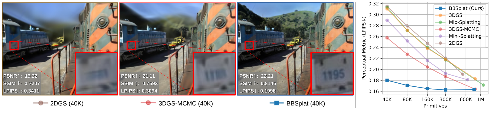
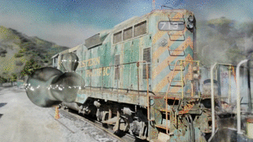
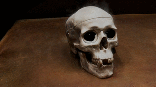
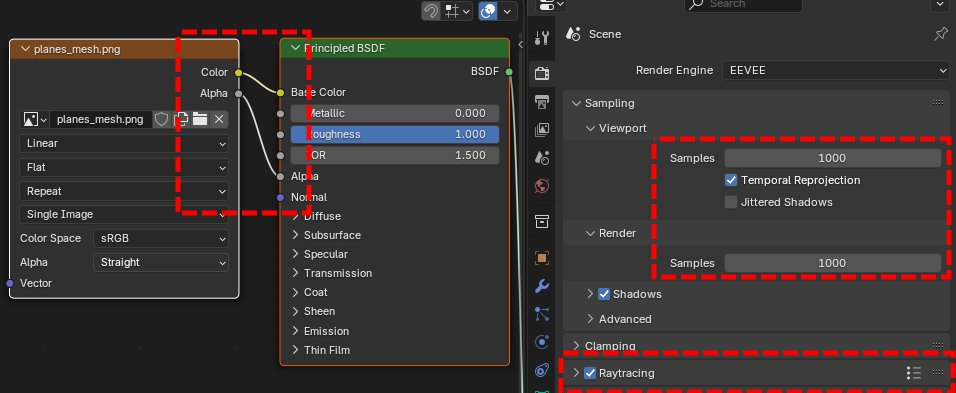
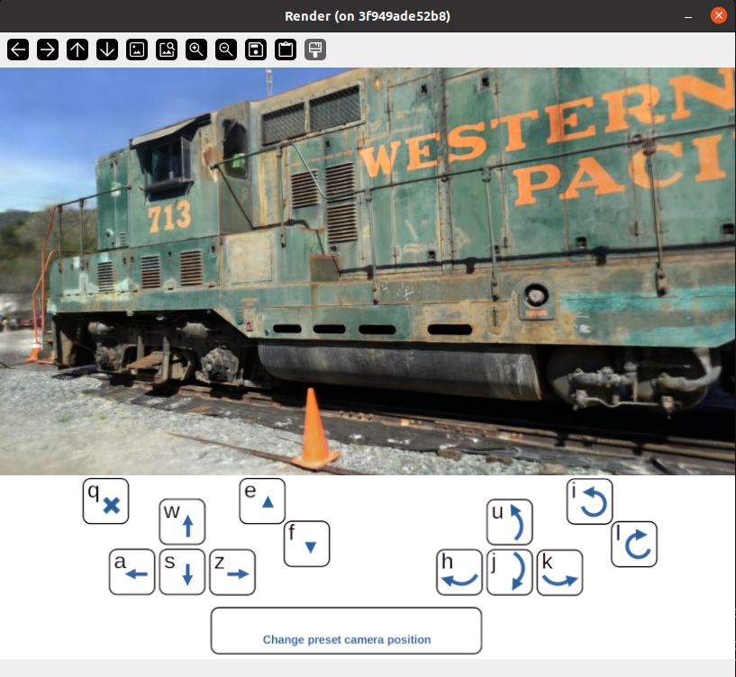

# BBSplat (BillBoard Splatting): 새로운 시점 합성을 위한 학습 가능한 텍스처 프리미티브

> **원본 프로젝트**: [프로젝트 페이지](https://david-svitov.github.io/BBSplat_project_page/) | [논문](https://arxiv.org/pdf/2411.08508) | [영상](https://youtu.be/ZnIOZHBJ4wM) | [BBSplat Rasterizer (CUDA)](https://github.com/david-svitov/diff-bbsplat-rasterization/) | [씬 예시 (1.5GB)](https://drive.google.com/file/d/1gu_bDFXx38KJtwIrXo8lMVtuY-P2PFXX/view?usp=sharing)

> **이 저장소는 PlanarSnap 프로젝트를 위한 포크입니다.** 원본 BBSplat에 여러 버그 수정 및 학습 품질 개선이 적용되었습니다.



---

## 개요

BBSplat은 텍스처가 있는 기하학적 프리미티브 기반의 새로운 시점 합성 방법입니다. 씬을 최적화 가능한 텍스처 평면 프리미티브의 집합으로 표현하며, 학습 가능한 RGB 텍스처와 알파맵으로 형태를 제어합니다. BBSplat 프리미티브는 기존 Gaussian Splatting 파이프라인에서 가우시안의 드롭인 대체재로 사용할 수 있습니다.

평면 프리미티브의 명시적인 특성 덕분에 2DGS 프레임워크와 유사하게 정확한 3D 메쉬를 추출할 수 있고, 레스터화 과정에서 레이트레이싱 효과도 활용할 수 있습니다. 스파스한 텍스처 구조를 유도하는 정규화 항을 통해 효율적인 압축이 가능하며, 3DGS 대비 최대 17배 저장공간을 절감합니다. Tanks&Temples, DTU, Mip-NeRF-360 데이터셋에서 우수한 성능을 보이며, DTU Full HD 해상도에서 29.72 dB PSNR을 달성합니다.

---

## 업데이트 (원본 BBSplat)

- 2025-02-10: FPS 측정 함수 버그 수정 및 프리프린트 업데이트
- 2025-03-13: 메쉬 추출 코드 공개

---

## 이 포크의 수정 사항

### 1. Float32 텍스처 저장/불러오기 (핵심 버그 수정)

**문제**: 원본 코드는 텍스처를 uint8 델타 인코딩으로 저장했습니다. 이때 완전 투명한 픽셀의 `-inf` 로짓 값이 작은 양수값(~0.004 alpha)으로 변환되어, 모델 로드 후 많은 빌보드에서 미세한 밝기 기여가 누적되었습니다. 결과적으로 **9~13 dB PSNR 손실** 및 갈색으로 뿌연 시각적 아티팩트가 발생했습니다.

**수정**: `save_texture()`가 raw float32 파라미터를 직접 저장하도록 변경했습니다. `load_texture()`는 dtype을 자동 감지하여 float32(새 형식)와 uint8(기존 형식) 모두 지원합니다.

```python
# scene/gaussian_model.py — save_texture()
def save_texture(self, folder_path):
    ta_f32 = self._texture_alpha.detach().cpu().numpy().astype(np.float32)
    tc_f32 = self._texture_color.detach().cpu().numpy().astype(np.float32)
    np.savez_compressed(os.path.join(folder_path, "texture_alpha.npz"), texture_alpha=ta_f32)
    np.savez_compressed(os.path.join(folder_path, "texture_color.npz"), texture_color=tc_f32)
```

### 2. Scaling/Rotation 학습률 지수 감소

학습이 진행되면서 지오메트리(크기, 회전)가 불안정하게 변화하는 것을 방지하기 위해, scaling과 rotation 파라미터에 지수 감소 학습률 스케줄러를 추가했습니다.

- 초기 학습률 → 30,000 iter에 걸쳐 10%로 감소
- 수렴 이후 빌보드 지오메트리 드리프트를 효과적으로 억제

### 3. PSNR 하락 방지: 3단계 수정 체인

기본값 `densify_until_iter=25000` 대신 **10,000**을 권장하며, 아래 3가지 수정이 함께 적용됩니다.

**문제**: room scene에서 PSNR이 iter 10,000(~26 dB 정점) 이후 iter 32,000까지 ~18~19 dB로 지속 하락.

**수정 1** — `opacity_reg`를 MCMC 종료 후 비활성화:  
`opacity_reg=0.01` 손실 항목이 MCMC 없이 계속 실행되면 모든 billboard alpha를 0으로 밀어냄.

**수정 2** — MCMC 종료 후 geometry(xyz/scaling/rotation) 동결:  
수렴한 지오메트리가 계속 업데이트되면 불필요한 drift 발생.

**수정 3** — MCMC 종료 시 텍스처(alpha/color)도 동결, 이후 SH(f_dc/f_rest)만 학습:  
`activate_texture_training()`이 매 iter 텍스처 LR을 초기값으로 리셋하기 때문에, MCMC 종료 후 고정 LR 업데이트가 수렴한 텍스처를 진동시킴.

**v13 결과 (room scene)**:

| Iter | Test PSNR |
|------|-----------|
| 10000 | 26.11 dB |
| 20000 | 26.28 dB |
| 32000 | 26.34 dB |

최종 metrics: PSNR **26.22** / SSIM **0.8298** / LPIPS **0.2999**

```bash
python train.py -s <데이터셋_경로> --model_path=<출력_경로> \
  --cap_max=160_000 --max_read_points=150_000 --add_sky_box --eval \
  --densify_until_iter 10000
```

### 4. CUDA 12.8 / WSL2 호환성 수정

아래 [CUDA 12.8 + WSL2 호환성](#cuda-128--wsl2-호환성) 섹션 참조.

---

## CUDA 12.8 + WSL2 호환성

**CUDA 12.8** 또는 **WSL2(Windows WDDM)** 환경에서 학습 시 다음 수정사항이 `train.py`에 이미 적용되어 있습니다. 원본 코드를 사용하는 경우 아래 변경사항을 직접 적용해야 합니다.

### train.py 필수 코드 변경사항

**1. 메모리 할당자** — `import torch` 이전에 추가:
```python
import os
os.environ["PYTORCH_CUDA_ALLOC_CONF"] = "expandable_segments:True,garbage_collection_threshold:0.8"
```
densification 이후 WSL2에서 발생하는 CUDA 메모리 단편화 스파이크(30~145초 backward 정지) 방지.

**2. 이미지 크기 16px 정렬** — 매 iter `render()` 호출 전 추가:
```python
viewpoint_cam.image_width  = viewpoint_cam.image_width  - (viewpoint_cam.image_width  % 16)
viewpoint_cam.image_height = viewpoint_cam.image_height - (viewpoint_cam.image_height % 16)
```
GT 이미지도 크롭하여 맞춤: `gt_image = gt_image[:, :viewpoint_cam.image_height, :viewpoint_cam.image_width]`  
CUDA 12.8 타일 레스터라이저가 16의 배수 크기를 요구함. 미적용 시 엣지 시임 아티팩트 또는 크래시 발생.

**3. 파라미터 클램핑** — 매 iter `render()` 전 추가:
```python
with torch.no_grad():
    gaussians._xyz.data = torch.clamp(gaussians._xyz.data, min=-10.0, max=10.0)
    if hasattr(gaussians, '_scaling'):
        gaussians._scaling.data = torch.clamp(gaussians._scaling.data, min=-15.0, max=5.0)
```
MCMC noise injection을 통한 NaN/Inf 전파 방지. 미적용 시 갈색 blob 아티팩트 및 학습 크래시 발생.

**4. MCMC noise에 고정 opacity 사용** — optimizer step 내 `opacity` 줄 교체:
```python
# texture_alpha 기반 opacity 대신:
opacity = torch.ones([gaussians._xyz.shape[0], 1], dtype=torch.float32, device="cuda")
```

### WSL2 전용 OS 수정 (Windows PowerShell 관리자 권한 실행)

```powershell
# GPU 타임아웃 2초 → 60초로 증가 (긴 CUDA 커널 실행 중 드라이버 리셋 방지)
reg add "HKLM\SYSTEM\CurrentControlSet\Control\GraphicsDrivers" /v TdrDelay /t REG_DWORD /d 60 /f
# TDR 완전 비활성화
reg add "HKLM\SYSTEM\CurrentControlSet\Control\GraphicsDrivers" /v TdrLevel /t REG_DWORD /d 0 /f
```

**하드웨어 가속 GPU 스케줄링(HAGS) 비활성화**: 설정 → 시스템 → 디스플레이 → 그래픽 → 기본 그래픽 설정 변경 → 하드웨어 가속 GPU 스케줄링 **끄기**

두 변경사항 모두 **재부팅** 필요.

---

## 저장소 구조

```bash
.
├── scripts                         # 데이터셋 처리용 bash 스크립트
│   ├── colmap_all.sh               # COLMAP으로 포인트 클라우드 추출
│   ├── dtu_eval.py                 # DTU Chamfer distance 평가
│   ├── train_all.sh                # 모든 씬 학습
│   ├── render_all.sh               # 모든 씬 렌더링
│   └── metrics_all.sh              # 모든 씬 메트릭 계산
├── submodules
│   ├── diff-bbsplat-rasterization  # BBSplat 레스터라이저 CUDA 구현
│   └── simple-knn                  # KNN CUDA 구현
├── docker                          # Docker 이미지 빌드/실행 스크립트
├── docker_colmap                   # COLMAP용 Docker 이미지
├── bbsplat_install.sh              # 서브모듈 빌드 및 설치
├── convert.py                      # COLMAP으로 포인트 클라우드 추출
├── train.py                        # BBSplat 씬 표현 학습
├── render.py                       # 새로운 시점 합성
├── metrics.py                      # 메트릭 계산
├── visualize.py                    # 인터랙티브 씬 시각화
├── extract_normals.py              # (PlanarSnap) 빌보드 노멀 추출
├── save_from_checkpoint.py         # 학습 체크포인트에서 point_cloud 저장
└── test_psnr.py                    # PSNR 진단 스크립트 (preproc=False vs True 비교)
```

---

## 설치

Docker를 이용한 빠른 설치:

```bash
# 클론
git clone https://github.com/david-svitov/BBSplat.git --recursive
cd BBSplat/docker

# Docker 이미지 빌드
bash build.sh
# source.sh에서 마운트 경로 조정 후
bash run.sh

# 컨테이너 내에서 서브모듈 설치
bash bbsplat_install.sh
```

<details>
<summary>COLMAP용 Docker 컨테이너</summary>

```bash
cd BBSplat/docker_colmap
bash run.sh

# 이 컨테이너에서 OpenCV 설치 필요
add-apt-repository universe
apt-get update
apt install python3-pip
python3 -m pip install opencv-python
```
</details>

> **서브모듈 재설치**: `submodules/diff-bbsplat-rasterization/` 내 `.cu` 또는 `.h` 파일 수정 후에는 반드시 `bash bbsplat_install.sh`를 실행해야 합니다.

---

## 데이터 전처리

`convert.py` 사용 예시는 `scripts/colmap_all.sh` 참조.  
COLMAP 출력 폴더에서 데이터셋에 따라 다른 `images_N` 폴더를 사용합니다. 3DGS/2DGS와 동일한 COLMAP 로더를 사용하며, [자세한 설명](https://github.com/graphdeco-inria/gaussian-splatting?tab=readme-ov-file#processing-your-own-scenes)을 참조하세요.

---

## 학습

### 기본 명령어

```bash
python train.py -s <COLMAP 처리된 데이터셋 경로> \
  --cap_max=160_000 --max_read_points=150_000 --add_sky_box --eval
```

### 주요 인자

```bash
--cap_max               # 빌보드 최대 개수
--max_read_points       # 초기화용 SfM 포인트 최대 개수
--add_sky_box           # 원거리 객체용 추가 포인트 생성
--eval                  # N번째 이미지마다 평가용으로 보류
--densify_until_iter    # MCMC densification 종료 iter (권장: 10000)
--lambda_normal         # 노멀 일관성 하이퍼파라미터
--lambda_distortion     # 깊이 왜곡 하이퍼파라미터
```

### 데이터셋별 권장 파라미터

| 데이터셋 | `--cap_max` | `--max_read_points` | 추가 플래그 |
|---|---|---|---|
| Mip-NeRF-360 실내 (room, bonsai, counter, kitchen) | 160,000 | 150,000 | `--add_sky_box --eval --densify_until_iter 10000` |
| Mip-NeRF-360 실외 (bicycle, stump, garden) | 300,000 | 290,000 | `--add_sky_box --eval --densify_until_iter 10000` |
| Tanks & Temples | 300,000 | 290,000 | `--add_sky_box --eval --densify_until_iter 10000` |
| DTU | 60,000 | 60,000 | `--lambda_normal=0.05 --lambda_dist 100 --eval` |

---

## 테스트

### 새로운 시점 합성 평가

```bash
python render.py -m <학습된 모델 경로> -s <COLMAP 데이터셋 경로>
```

```bash
--skip_mesh     # 메쉬 추출 비활성화 (NVS 평가 가속)
--save_planes   # BBSplat을 텍스처 평면 집합으로 저장
```

메트릭 계산:
```bash
python metrics.py -m <학습된 모델 경로>
```

---

❗ **빠른 추론**

`submodules/diff-bbsplat-rasterization/cuda_rasterizer/auxiliary.h`에서 `#define FAST_INFERENCE 0`을 `1`로 변경한 뒤 `bash bbsplat_install.sh`로 재빌드. 약 ×2 속도 향상, 약간의 메트릭 저하.

---

### DTU Chamfer distance 평가

```bash
python scripts/dtu_eval.py \
  --dtu=<전처리된 DTU 데이터셋 경로> \
  --output_path=<학습 결과 저장 경로> \
  --DTU_Official=<공식 DTU 데이터셋 경로>
```

---

## Blender로 내보내기

<p float="left">


</p>

1. `submodules/diff-bbsplat-rasterization/cuda_rasterizer/auxiliary.h`에서:
   - `#define TILE_SORTING 0` → `1`
   - `#define PIXEL_RESORTING 0` → `1`
   - `#define FAST_INFERENCE 0` 유지 (0이어야 함)
2. `bash bbsplat_install.sh`로 재빌드
3. `python render.py --save_planes` 실행 → `planes_mesh.obj` 생성
4. Blender에서 obj 파일 임포트 후 알파 텍스처 셰이더 설정, EEVEE 레이트레이싱 활성화



---

## 인터랙티브 시각화



```bash
python visualize.py -m <모델 경로> -s <데이터셋 경로>
```

`render.py`와 동일한 `-m -s` 인자를 사용합니다.

---

## 인용

```bibtex
@article{svitov2024billboard,
  title={BillBoard Splatting (BBSplat): Learnable Textured Primitives for Novel View Synthesis},
  author={Svitov, David and Morerio, Pietro and Agapito, Lourdes and Del Bue, Alessio},
  journal={arXiv preprint arXiv:2411.08508},
  year={2024}
}
```
